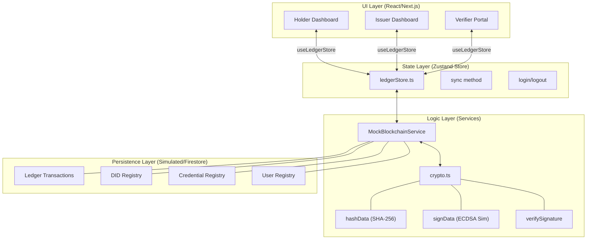
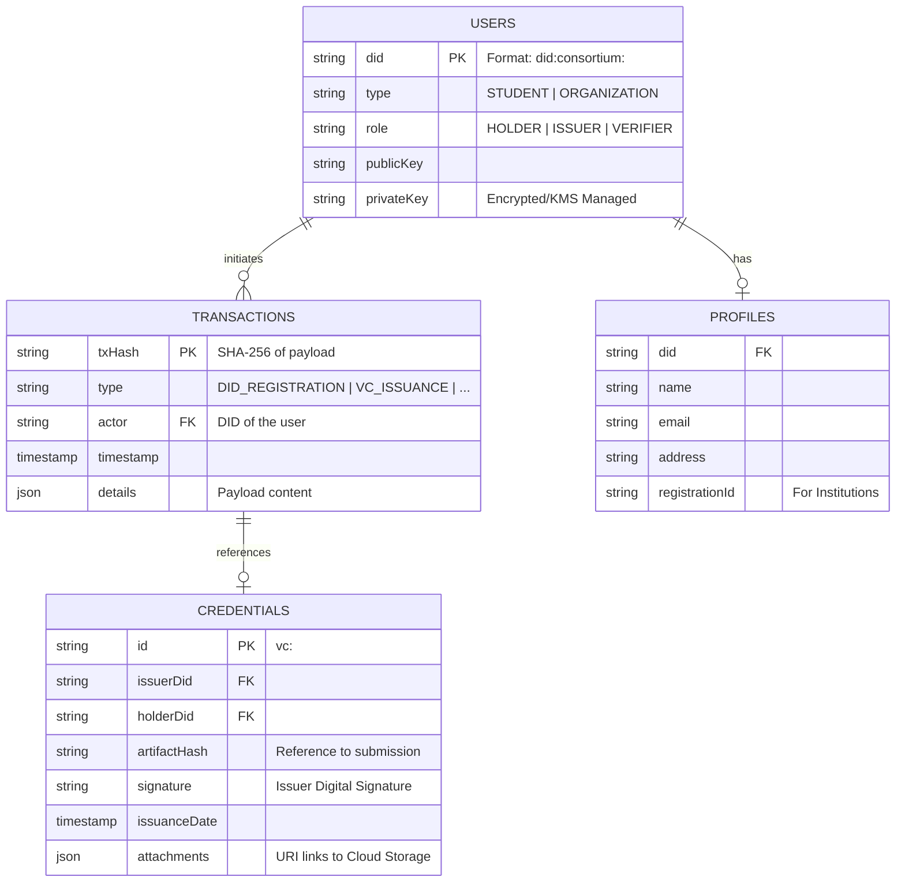
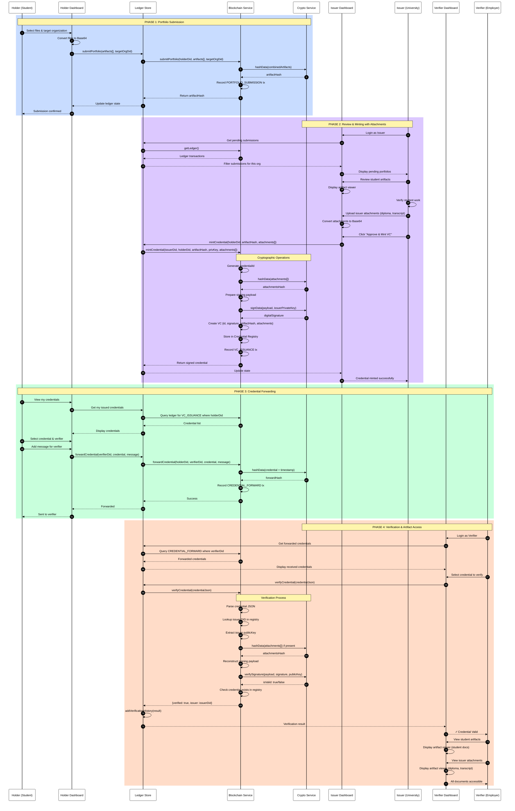
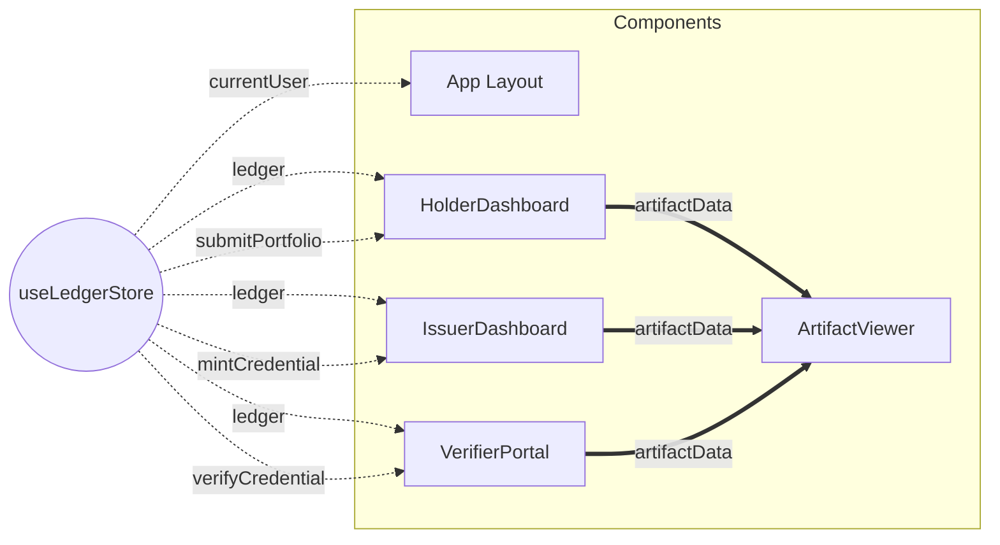

# Consortium Project: Detailed Schematic Diagrams

This document provides an expanded technical visualization of the Consortium Decentralized Credentialing System, including the data persistence layer and component-level interactions.

## 1. Comprehensive System Architecture

This diagram illustrates the flow from the UI layer down to the cryptographic services and the simulated blockchain registries.

## 2. Firebase Firestore Database Schematic (ERD)

The following schema represents the intended Firestore structure for persisting the DLT state. It maps the current `MockBlockchainService` data structures to a scalable NoSQL hierarchy.

## 3. Complete End-to-End Credential Lifecycle

This comprehensive sequence diagram shows the full journey from student portfolio submission, through issuer minting with attachments, to verifier receiving and validating the credential.

## 4. Component Interaction Layout

Visualizing how the React components consume the global store.

## 5. Security Summary
- **Data Integrity**: Artifacts are immutable once hashed and recorded in `PORTFOLIO_SUBMISSION`.
- **Non-Repudiation**: `VC_ISSUANCE` is tied to an Issuer via ECDSA-simulated signatures.
- **Verification**: Zero-trust model where Verifiers check both the signature and the presence of the record on the ledger.
